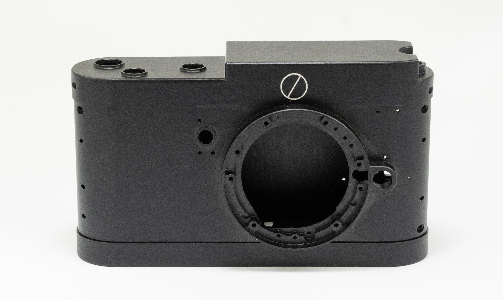

# Leica G9II

> The internals of a Panasonic Lumix G9II inside a Leica M-style body — featuring custom CNC-machined parts and redesigned flex cables and buttons.

---

## 📸 Overview

This project is an attempt to make a beautiful small camera from a Lumix G9II body. The camera is focused on street photography and has missing buttons and features.

If you are an expert in any relevant field and see mistakes you are welcome to open issues for discussion, my only qualification to do this is that I was into electronics a long time ago.

---

## What's Included

- `/CADs/` – STEP files for CNC machining, including threads sheets
- `/FPCBs/` – Schematics and gerber files for the flex cables
- `/Datasheets/` – Some datasheets from used components
- `/BOM/` – List of extra items and purchase links

---

## Materials (BOM)

| Part                | Description                      | Notes |
|---------------------|----------------------------------|-------|
| Top plate           | Milled aluminum                  | Included in CADs |
| Base plate          | Milled aluminum                  |  |
| Front               | Milled aluminum                  |  |
| Back                | Milled aluminum                  |  |
| Heatsink            | Milled copper                    |  |
| Flex cable          | Internal routing rework          | Included in FPCBs |
| Screws              | M1.6 and M2                      | Refer to threads sheets in CADs |
| Body (G9II)         | Donor camera                     ||

---

## Build Instructions

> ⚠️ Advanced DIY skills required: electronics, soldering, disassembly without breaking, modifying original parts
> ⚠️ WIP

1. Disassemble Lumix G9II (see [https://www.youtube.com/@CameraSurgery])
2. Machine or print parts from `/CADs/`
3. Print flex cables from `/FPCBs/`
4. Install mount, lens release button
5. Install shutter
6. Install sensor
7. Install front lever and battery flex cable
8. Install heatsink
9. Install mainboard
10. Install top plate dials and flex cables
11. Install back buttons and flex cable
12. Install screen
13. Install viewfinder
14. Install wifi module
15. Assemble
16. Add leatherete
17. Install front lever

---

## Parts removed

1. Lens release push detector (not sure what it was doing beside displaying some info on the screen). There is not enough space to add this push detector
2. The following buttons: ISO-WB, front custom buttons

---

## TO DO:
- The dials are too lose
- The buttons are too short
- Thread missing from the lever clicker
- Remove back wheel
- Dials gaskets too thin (0.5mm), must be wider (1mm)
- Front and back could be extended up and down for better strength

---

## Licence

This project is licensed under the CERN Open Hardware Licence Version 2 – Permissive (CERN-OHL-P-2.0).

---

## 💬 Credits

Created by [Cristian Baluta]  
Youtube: [https://www.youtube.com/@CameraSurgery]
